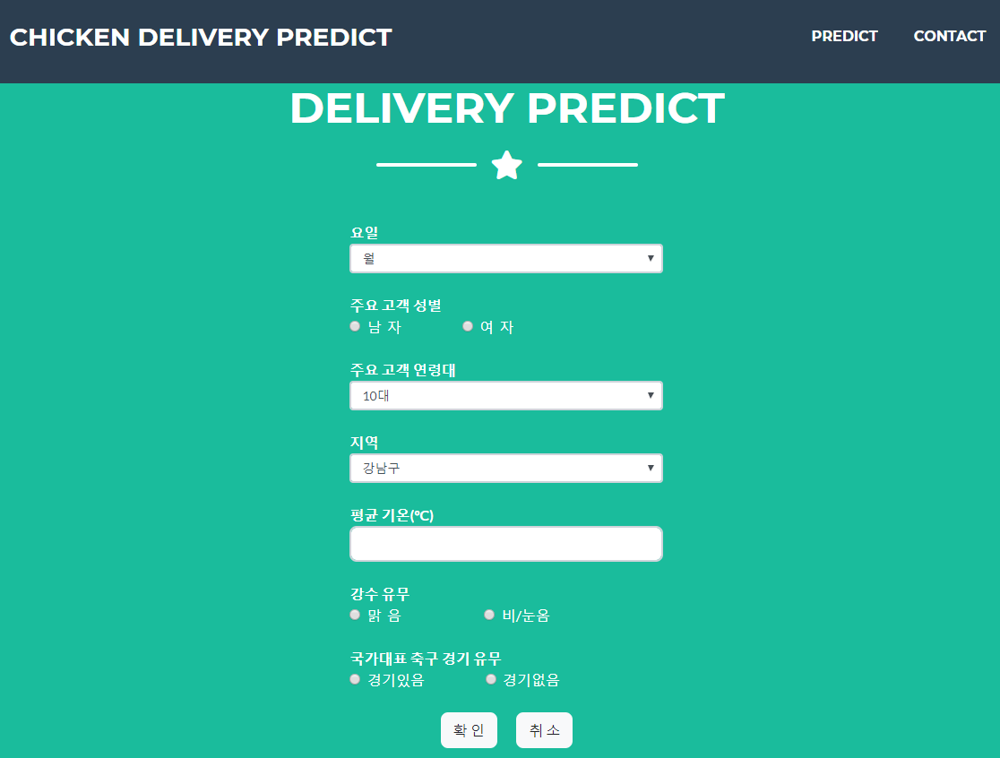
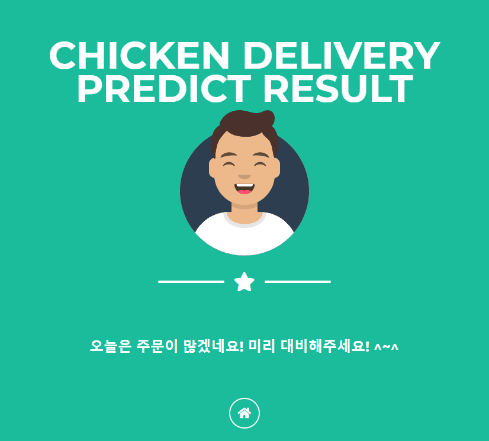

# 치킨 주문건수 예측 웹서비스

SK Bigdata hub에서 제공하는 ‘서울시 치킨 판매업종 이용 통화량 데이터(2017년 1월 ~ 19년 9월)’를 활용하여 치킨 배달 주문 건수와 날씨/축구 경기와의 상관관계를 분석하여 배달량을 예측해주는 서비스입니다.

### 기술 스택

Python3, Flask, sklearn

### 조원 소개 및 역할

최민창: 데이터 수집 및 크롤링, 전처리
권윤옥: 데이터 시각화 및 전처리, 분석, 웹 서비스 제작

### 분석 보고서

[보고서 링크](https://github.com/ahyz0569/Predict_chicken_order/blob/master/report/Module_Project_Report.pdf)

### 웹서비스 예시 이미지
데이터 예측에 사용되는 컬럼들의 정보(요일, 성별, 연령대, 지역, 평균 기온, 강수 유무, 국가대표 축구 경기 유무)를 입력하면 예측한 결과값에 따라 메세지를 출력할 수 있도록 구성

예측 결과 페이지 예시 이미지

### 분석 데이터 출처

- SK BIGDATA HUB: https://www.bigdatahub.co.kr/index.do
- 기상청 기상자료개방포털: https://data.kma.go.kr/cmmn/main.do
- 네이버 스포츠: https://sports.news.naver.com/kfootball/schedule/index.nhn?category=amatch

